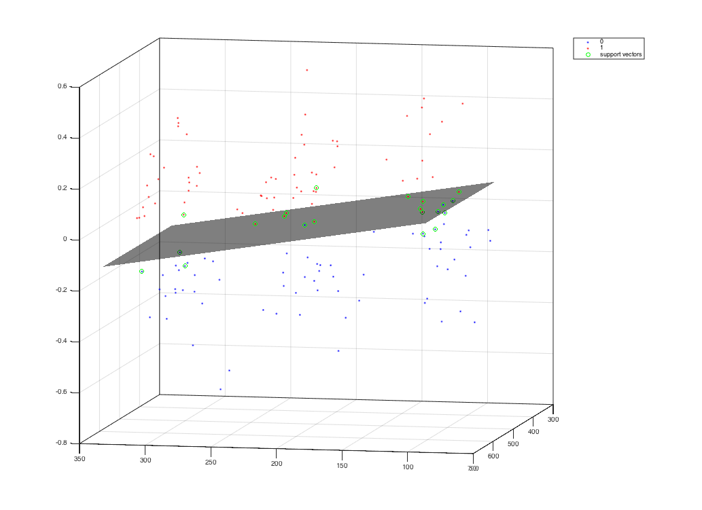

# Augmented Touch - Potential Device Behaviour 

## Introduction

Augmented Touch is a project on touch behaviour. It included the effect of using touch positon feature and sensor features to analysis hand posture classification probelm and authentication user on mobile devices.

I wish you could be inspired by this repository to keep interested in develop a new way to use sensor information, such as adapt user interface on mobile devices by using sensor behaviour and touch behaviour. You can see a very breif demo on [YouTube](https://youtu.be/voyEDZ6Awzw).

This project is inspired and coached from few of touch behaviour research by [Daniel Buschek](http://www.medien.ifi.lmu.de/team/daniel.buschek/), and you can find the related works [here](https://scholar.google.de/citations?user=TsVkUBwAAAAJ).

## Content
----------
* [About](./README.md)
* Projects
  - [MotionGraphs](./src/MotionGraphs/README.md)
  - [TouchMotion Collect](./src/TouchMotion Collect/README.md)
* [Github license](./LICENSE)

## Basic Results Reveal

coming soon...

## References
-------------
 1. [Alon, J., Sclaroff, S., Kollios, G., & Pavlovic, V. (2003). Discovering clusters in motion time-series data. 2003 IEEE Computer Society Conference on Computer Vision and Pattern Recognition, 2003. Proceedings., 1, I–375.](http://doi.org/10.1109/CVPR.2003.1211378)
 - [Buschek, D., & Alt, F. (2015). TouchML. In Proceedings of the 20th International Conference on Intelligent User Interfaces - IUI ’15 (pp. 110–114). New York, New York, USA: ACM Press.](http://doi.org/10.1145/2678025.2701381)
 - [Buschek, D., De Luca, A., & Alt, F. (2015). Improving Accuracy, Applicability and Usability of Keystroke Biometrics on Mobile Touchscreen Devices. In Proceedings of the 33rd Annual ACM Conference on Human Factors in Computing Systems - CHI ’15 (pp. 1393–1402). New York, New York, USA: ACM Press.](http://doi.org/10.1145/2702123.2702252)
 - [Buschek, D., Rogers, S., & Murray-Smith, R. (2013). User-specific touch models in a cross-device context. In Proceedings of the 15th international conference on Human-computer interaction with mobile devices and services - MobileHCI ’13 (p. 382). New York, New York, USA: ACM Press.](http://doi.org/10.1145/2493190.2493206)
 - [Buschek, D., Schoenleben, O., & Oulasvirta, A. (2014). Improving accuracy in back-of-device multitouch typing. In Proceedings of the 19th international conference on Intelligent User Interfaces - IUI ’14 (pp. 57–66). New York, New York, USA: ACM Press.](http://doi.org/10.1145/2557500.2557501)
 - [Goel, M., Wobbrock, J. O., & Patel, S. N. (2012). GripSense: Using built-in sensors to detect hand posture and pressure on commodity mobile phones. In Proceedings of the 25th annual ACM symposium on User interface software and technology (pp. 545–554).](http://dl.acm.org/citation.cfm?id=2380184)
 - [Hinckley, K., & Song, H. (2011). Sensor Synaesthesia : Touch in Motion , and Motion in Touch. Human Factors, 801–810.](http://doi.org/10.1145/1978942.1979059)
 - [Holz, C., & Baudisch, P. (2010). The Generalized Perceived Input Point Model and How to Double Touch Accuracy by Extracting Fingerprints. Proceedings of the 28th International Conference on Human Factors in Computing Systems - CHI ’10, 581–590.](http://doi.org/10.1145/1753326.1753413)
 - [Krishnan, Narayanan; Cook, D. (2012). Activity Recognition on Streaming Sensor Data, 13(9), 1133–1145.](http://doi.org/10.1016/j.micinf.2011.07.011.Innate)
 - [McGrath, W., & Li, Y. (2014). Detecting Tapping Motion on the Side of Mobile Devices By Probabilistically Combining Hand Postures.In UIST 2014 (pp. 215–219).]()
 - [Negulescu, M., & McGrenere, J. (2015). Grip Change as an Information Side Channel for Mobile Touch Interaction. In CHI 2015 (pp. 1519–1522).]()
 - [Seipp, K., & Devlin, K. (2014). BackPat: One-Handed Off-Screen Patting Gestures. In MobileHCI 2014 (pp. 6–9).]()

## Contributors

[Changkun Ou](http://changkun.us/about/)

## Advisor

[Daniel Buschek](http://www.medien.ifi.lmu.de/team/daniel.buschek/)

## License

&copy; Contributors & Advisor, 2015-2016. Licensed under an GNU Public v2 license.
