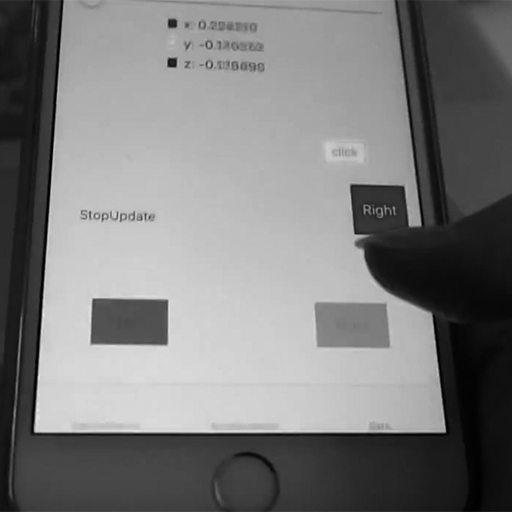

# AugmentedTouch: A Study in Sensors Augment Classification Accuracy of Using Touch Position or Touch Offset Features

> January 11, 2016 by Changkun Ou
> 
> Link: [GitHub](https://github.com/changkun/AugmentedTouch/blob/master/report/result-summary.md)

## Introduction

This report aims to summary five parts of exploring in human touch behavior and  sensor features influence classification accuracy in posture predicting and how these features influence a classification model for authentication:

0. TouchML.framework for iOS
1. Dynamic UI with different hand posture;
2. App Prototyping for predict user's posture of hold their device;
3. Result and feedback from participants of an User Study in using PIN Entry Design;
4. Performance and conclution of sensor augment touch position ( or touch offset) features.

> All the dataset, analysis source code, results even the commit history can be download on the GitHub: [https://github.com/changkun/AugmentedTouch](https://github.com/changkun/AugmentedTouch)

## Implementation

### TouchML for iOS

### Dynamic UI

> **Source Code**: [MotionGraphs](https://github.com/changkun/AugmentedTouch/tree/master/src/MotionGraphs)
> 
> **Demo**: [https://www.youtube.com/watch?v=voyEDZ6Awzw](https://www.youtube.com/watch?v=voyEDZ6Awzw)

<div align="center">
	
	
	<p><strong>Fig 1.</strong> Dynamic UI</p>
</div>

<div align="center">
	<div>
	
	</div>
	
	<p><strong>Fig 2.</strong> Dynamic UI</p>
</div>

### Prototyping App for Testing

> Source Code: [TouchMotion Collect](https://github.com/changkun/AugmentedTouch/tree/master/src/TouchMotion%20Collect)

<div align="center">
	
	
	<p><strong>Fig 3.</strong> Hand posture predicting: </p>
</div>

### Pre-Test

<div align="center">

<p><strong>Fig 5.</strong> PIN-Entry Study: </p>
</div>

### Applying User Study
> Source Code: [TouchMotion](https://github.com/changkun/AugmentedTouch/tree/master/src/TouchMotion)

In this user study, we are primarily interested in the .. of ..
This also helps to improve our understanding of 

<div align="center">
	
	
	<p><strong>Fig 4.</strong> PIN-Entry Study: </p>
</div>

Each participant completed a sit down meeting maintain half one-hour for input 6 PINS x 10 repetitions x 6 touches x 4 hand postures x 2 devices(iPhone 6 Plus and iPhone 5).
The 6 PINs are pre-install on the study app, which is 273849, 593827, 950284, 020485, 857162, 495937, all of these numbers are randomly generated.

At the end of user study, we collected statistics, 16 joined participants which from 10 people of male and 6 people of female. The age range of Participants from 19 to 34, and half of participants are range in 23 to 27. A questionnaire invastigation after participants finished study shows the average of participants touch screen smartphone use age

## Evaluation


### Datasets Description

Our datasets contains three parts, which is the touch moment datasets, sensor buffer of a tap moment and a related questionnaire dataset of JSON format based.

#### Touch-Moment Dataset

Every moment record recorded the moment of touch position and offset, including values of device attitute, accelerator and gyroscope sensors.
For each participant, the study App can record multi-times(test_count). In every test case, participant can tap multi-times(tap_count), and every tap have three different type that participants may not realized they actrally moved their finger when the applying a touch, which means this moment dataset recording from finger upon the screen to the finger detached.

| Fields | Explanations |
|:--:|:--:|
|id|an unique id for SQL database store, meaningless|
|user_id|Participant ID|
|test_count| Means which test sitiation is|
|test_case| Enumeration type, 0 means random numbers for input, 1 means pre-install numbers for input|
|tap_count|means how many touch was tapped in a test_count|
|moving_flag| Enumeration type, 0 means began of touch event, 1 means moving events, 2 means end of touch event|
|hand_posture| Enumeration type, which hand posture for this SQL resord, 0 means left thumb, 1 means right thumb, 2 means left index-finger, 3 means right index-finger|
|x|X-axis touch offset of whole screen view|
|y|Y-axis touch offset of whole screen view|
|offset_x|X-axis touch offset of left top corner of the click button|
|offset_y|Y-axis touch offset of left top corner of the click button|
|roll| A roll is a rotation around a longitudinal axis that passes through the device from its top to bottom. |
|pitch|A pitch is a rotation around a lateral axis that passes through the device from side to side.|
|yaw|A yaw is a rotation around an axis that runs vertically through the device. It is perpendicular to the body of the device, with its origin at the center of gravity and directed toward the bottom of the device.|
|acc_x|The X-axis value of a  3-axis acceleration values.|
|acc_y|The Y-axis value of a  3-axis acceleration values.|
|acc_z|The Z-axis value of a  3-axis acceleration values.|
|rotation_x|The X-axis rotation rate in radians per second. The sign follows the right hand rule: If the right hand is wrapped around the X axis such that the tip of the thumb points toward positive X, a positive rotation is one toward the tips of the other four fingers.|
|rotation_y|The Y-axis rotation rate in radians per second. The sign follows the right hand rule: If the right hand is wrapped around the Y axis such that the tip of the thumb points toward positive Y, a positive rotation is one toward the tips of the other four fingers.|
|rotation_z|The Z-axis rotation rate in radians per second. The sign follows the right hand rule: If the right hand is wrapped around the Z axis such that the tip of the thumb points toward positive Z, a positive rotation is one toward the tips of the other four fingers.|
|touch_time| Exactly time of touch moment |

#### Touch-Buffer Dataset

Every buffer recorded 50 records in this Buffer Datasets and record time interval is 0.01s, which means  every buffer recorded 0.5 sec. before every touch moment. The following table described the SQL dataset fields design(Obviously, NoSQL database can be much convenient for storing data type of time series, but now iOS has not yet published an mature open source library):

| Fields | Explanations |
|:--:|:--:|
|id|an unique id for SQL database store, meaningless|
|user_id|participant ID|
|test_count| Means which test sitiation is|
|test_case| Enumeration type, 0 means random numbers for input, 1 means pre-install numbers for input|
|tap_count|means how many touch was tapped in a test_count|
|sensor_flag| Enumeration type, 0 means device attitute, 1 means accelerometer, 2 means gyroscope, and when sensor_flag equals zero, the following feature x,y,z respectively mean roll, pitch, ywa which is described in the moment dataset|
|hand_posture| Enumeration type, which hand posture for this SQL resord, 0 means left thumb, 1 means right thumb, 2 means left index-finger, 3 means right index-finger|
|x|The X-axis value of sensor in current sensor_flag|
|y|The Y-axis value of sensor in current sensor_flag|
|z|The Z-axis value of sensor in current sensor_flag|

#### Related Questionnaire Dataset

Here is an example of this dataset:
	
```json
{
	"id" : 16,
	"condition" : [4,3,2,1],
	"device" : [2,1],
	"user": {
		"gender" : "female",
		"age" : 19,
		"dominant" : "right",
		"phone" : "Phone Model",
		"use_age" : 3,
		"operation" : {
			"left_thumb" : 3,
			"right_thumb" : 4,
			"left_index" : 1,
			"right_index" : 2,
			"pin" : 5,
			"fingerprint" : 0
		}
	}
}
```

And the following table shows some fields explanation:

| Fields | Explanations |
|:--:|:--:|
| condition | a list of test posture order, 1 means using left thumb, 2 means using right thumb, 3 means using left index-finger and 4 means using right index-finger |
| device | a list of test device order, 1 means iPhone 6 Plus, 2 means iPhone 5|
| operation | anwser of how often in each posture, 0 means don't have it, 1 means never, 2 means rarely, 3 means sometimes, 4 means often and 5 means always|


### Experiment Setup

In this study, we evaluate the most comprehensive cases of four different classification problem through five different analysis model.

These five different analysis model contains the problem in classification of hand posture and authentication of PIN Entry with sensor features.

#### Models and Parameters

##### 
1. 
2. **User Model**: Use split data in same device 
3. **Basic Device-Cross Validation**: 
4. **Basic Device-Cross Validation**: 
5. **User-**:


| Classification Condition | classification Problem |
|:----------:|:-----------------:|
|1|Left thumb and right thumb binary classification|
|2|Left index-finger and right index-finger binary classification|
|3|left and right thumb, left and right index-finger multi-classification|
|4|left and right hand binary classification |

(left thumb and index-finger data as left hand)

| Feature Condition | Feature Component (with Position) | Feature Component (with Offset) |  
|:--:|:--|:--|
|0|(x, y)|(offset_x, offset_y)|
|1|(x, y, atti_roll)|(offset_x, offset_y, atti_roll)|
|2|(x, y, atti_pitch)|(offset_x, offset_y, atti_pitch)|
|3|(x, y, atti_yaw)|(offset_x, offset_y, atti_yaw)|
|4|(x, y, acce_x)|(offset_x, offset_y, acce_x)|
|5|(x, y, acce_y)|(offset_x, offset_y, acce_y)|
|6|(x, y, acce_z)|(offset_x, offset_y, acce_z)|
|7|(x, y, gyro_x)|(offset_x, offset_y, gyro_x)|
|8|(x, y, gyro_y)|(offset_x, offset_y, gyro_y)|
|9|(x, y, gyro_z)|(offset_x, offset_y, gyro_z)|
|10|(x, y, atti_{roll,pitch,yaw})|(offset_x, offset_y, atti_{roll,pitch,yaw})|
|11|(x, y, acce_{x,y,z})|(offset_x, offset_y, acce_{x,y,z})|
|12|(x, y, gyro_{x,y,z})|(offset_x, offset_y, gyro_{x,y,z})|
|13|(x, y, atti{roll,pitch,yaw}, acce{x,y,z})|(offset_x, offset_y, atti{roll,pitch,yaw}, acce{x,y,z})|
|14|(x, y, atti{roll,pitch,yaw}, gyro{x,y,z})|(offset_x, offset_y, atti{roll,pitch,yaw}, gyro{x,y,z})|
|15|(x, y, acce{x,y,z}, gyro{x,y,z})|(offset_x, offset_y, acce{x,y,z}, gyro{x,y,z})|
|16|(x, y, atti_{roll,pitch,yaw}, acce_{x,y,z}, gyro_{x,y,z})|(offset_x, offset_y, atti_{roll,pitch,yaw}, acce_{x,y,z}, gyro_{x,y,z})|


### Result


> In order to reproduce the result of this paper, we open source the analysis code and dataset (participants infomation are removed due to privacy protection) on the Github under GPLv2 Licence. If you interested in this study, you can also download the user study app and applying your work on this idea even expanding it.

| Average of Classification Accuracy(%) |||
|:--:|:--:|:--:|
| FeatureID | with XY-Position feature | with Offset feature |

<div align="center">

<p><strong>Fig 5.</strong> Error Rate: </p>
</div>

<div align="center">

<p><strong>Fig 5.</strong> ROC Curve: </p>
</div>


What is interesting in this result is that ...

The difference between iPhone 6 Plus 

## Discussion

### Limitations


## Conclusions

1. 部分传感器特征的引入能够大幅度提高只使用用户触摸位置进行握持手姿的分类预测
2. Offset 特征比 Position 特征获得更好的分类精度
3. 

## Feature Work 

### Expansibility


### Uncovered Feilds

## References

[1] 这篇文章探究了 Gyro 结合 touch 行为的手势探究
没有完成的:
1. 只分析了 Thumb
2. buffer size 不同.

@inproceedings{Goel2012,
author = {Goel, Mayank and Wobbrock, Jacob O. and Patel, Shwetak N.},
booktitle = {Proceedings of the 25th annual ACM symposium on User interface software and technology},
file = {:Users/ouchangkun/Documents/Mendeley Desktop/Goel, Wobbrock, Patel/Proceedings of the 25th annual ACM symposium on User interface software and technology/Goel, Wobbrock, Patel - 2012 - GripSense Using built-in sensors to detect hand posture and pressure on commodity mobile phones.pdf:pdf},
isbn = {9781450315807},
keywords = {a user to perform,figure 1,gripsense senses,hand,infers pressure exerted on,interactions,it is difficult for,left,like pinch-to-zoom with one,mobile,right,s hand posture and,situational impairments,the screen,touchscreen,user},
pages = {545--554},
title = {{GripSense: Using built-in sensors to detect hand posture and pressure on commodity mobile phones}},
url = {http://dl.acm.org/citation.cfm?id=2380184},
year = {2012}
}

[2] 这篇文章探究了 Touch 和 Motion 类型的
@article{Hinckley2011a,
abstract = {We explore techniques for hand-held devices that leverage the multimodal combination of touch and motion. Hybrid touch + motion gestures exhibit interaction properties that combine the strengths of multi-touch with those of motion- sensing. This affords touch-enhanced motion gestures, such as one-handed zooming by holding ones thumb on the screen while tilting a device. We also consider the reverse perspective, that of motion-enhanced touch, which uses motion sensors to probe what happens underneath the surface of touch. Touching the screen induces secondary accelerations and angular velocities in the sensors. For example, our prototype uses motion sensors to distinguish gently swiping a finger on the screen from drags with a hard onset to enable more expressive touch interactions.},
author = {Hinckley, Ken and Song, Hyunyoung},
doi = {10.1145/1978942.1979059},
file = {:Users/ouchangkun/Documents/Mendeley Desktop/Hinckley, Song/Human Factors/Hinckley, Song - 2011 - Sensor Synaesthesia Touch in Motion , and Motion in Touch.pdf:pdf},
isbn = {9781450302678},
journal = {Human Factors},
pages = {801--810},
title = {{Sensor Synaesthesia : Touch in Motion , and Motion in Touch}},
url = {http://portal.acm.org/citation.cfm?id=1979059},
year = {2011}
}

[3]@inproceedings{Buschek2013b,
abstract = {We present a machine learning approach to train user-specific offset models, which map actual to intended touch locations to improve accuracy. We propose a flexible framework to adapt and apply models trained on touch data from one device and user to others. This paper presents a study of the first published experimental data from multiple devices per user, and indicates that models not only improve accuracy between repeated sessions for the same user, but across devices and users, too. Device-specific models outperform unadapted user-specific models from different devices. However, with both user- and device-specific data, we demonstrate that our approach allows to combine this information to adapt models to the targeted device resulting in significant improvement. On average, adapted models improved accuracy by over 8{\%}. We show that models can be obtained from a small number of touches (� 60). We also apply models to predict input-styles and identify users.},
address = {New York, New York, USA},
author = {Buschek, Daniel and Rogers, Simon and Murray-Smith, Roderick},
booktitle = {Proceedings of the 15th international conference on Human-computer interaction with mobile devices and services},
doi = {10.1145/2493190.2493206},
isbn = {9781450322737},
pages = {382--391},
publisher = {ACM Press},
title = {{User-Specific Touch Models in a Cross-Device Context}},
url = {http://eprints.gla.ac.uk/80621/},
year = {2013}
}
