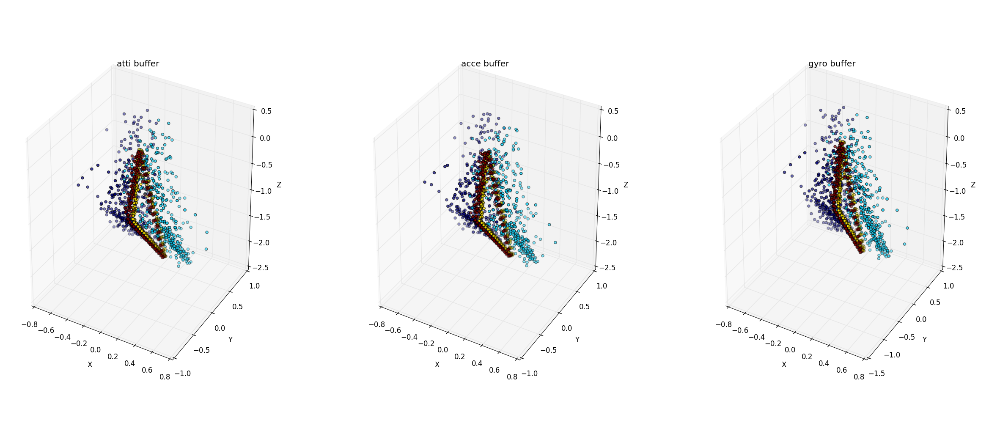

# AugmentedTouch: A Study in Sensors Augment Classification Accuracy of Using Touch Position or Touch Offset Features

> January 15, 2016 by Changkun Ou
> 
> Public Version
> 
> Link: [GitHub](https://github.com/changkun/AugmentedTouch/blob/master/report/result-summary.md)

## I. Introduction

--- goals for reading this paper

This report aims to summary five parts of exploring in human touch behavior and  sensor features influence classification accuracy in posture predicting and how these features influence a classification model for authentication:

0. TouchML framework for iOS;
1. Dynamic UI with different hand posture;
2. App Prototyping for predict user's posture of hold their device;
3. Result and feedback from participants of an User Study in using PIN Entry Design;
4. Performance and conclution of sensor augment touch position ( or touch offset) features.

> All the dataset, analysis source code, results even the commit history can be download on the GitHub: [https://github.com/changkun/AugmentedTouch](https://github.com/changkun/AugmentedTouch)

## II. Prototyping

### 2.1 TouchML for iOS

This part mainly disscuss a TouchML framework[4] implementation on iOS devices..

Coming soon...

### 2.2 Dynamic UI

> **Source Code**: [MotionGraphs](https://github.com/changkun/AugmentedTouch/tree/master/src/MotionGraphs)
> 
> **Demo**: [https://www.youtube.com/watch?v=voyEDZ6Awzw](https://www.youtube.com/watch?v=voyEDZ6Awzw)

<div align="center">
	
	
	<p><strong>Fig 1.</strong> Dynamic UI: The user interface of an App could be change by a previous testing before lunch, and if this previous test could detect which hand are currently using, then this App could change it's UI for doing adaptions. Left figure show a previous test by hit two buttons repetedly, similar with the fitts law experiment. When this test finished, a new button appear on the left side. The right figure are do thing as same as left figure description but the button will shows on the right when it finished.</p>
</div>

<div align="center">
	<div>
	
	</div>
	
	<p><strong>Fig 2.</strong> GyroInfo: This figures group shows the wave pattern of gyroscope sensor , it represent when a user hit two button side by side repetedly.  The upper figure indicate left hand action, and the bottom figure indicate right hand action.</p>
</div>

### 2.3 Pre-test

<div align="center">

<p><strong>Fig 3.</strong> SVM Hyper-plane: a small dataset applied simple linear SVM classification for different thumb, it only use touch position and one of device attitute angle features(3 features, (x,y,roll)). The red point indicate left thumb data and blue point indicate right thumb data.</p>
</div>

### 2.4 Prototyping App for Testing

> Source Code: [TouchMotion Collect](https://github.com/changkun/AugmentedTouch/tree/master/src/TouchMotion%20Collect)

<div align="center">
	
	
	<p><strong>Fig 4.</strong> Prototype: we setup the data collection and traning system ( using (x,y,roll) three features ) on mobile devices for a convenient test. This App will predict which hand are using. </p>
</div>

Inspired by this App, author observed if the traning data came from only one user, then the model sometimes won't work with other users. And also the sensor feature only used one component. So we try to designed an user study to collect a large dataset to exploring  how sensor features influence this classification accuracy and whether the dataset could be using on authentification or not.

### 2.5 Applying User Study
> Source Code: [TouchMotion](https://github.com/changkun/AugmentedTouch/tree/master/src/TouchMotion)

In this user study, we are primarily interested in the accuracy of sensor feature extensions.

This also helps to improve our understanding of sensor feature effects.

#### 2.5.1 User Study Procedure
--- describe it people who can re-inmplement it.


<div align="center">
	
	
	<p><strong>Fig 5.</strong> PIN-Entry Study Interface</p>
</div>

Each participant completed a sit down meeting maintain half one-hour for input **6 PINS x 10 repetitions x 6 touches x 4 hand postures x 2 devices**(iPhone 6 Plus and iPhone 5).
The 6 PINs are pre-install on the study app, which is **273849, 593827, 950284, 020485, 857162, 495937,** all of these numbers are randomly generated.

At the end of user study, we collected statistics, 16 joined participants which from 10 people of male and 6 people of female. The age range of Participants from 19 to 34, and half of participants are range in 23 to 27. A questionnaire invastigation after participants finished study shows the average of participants age of use touch screen smartphone almost five years. Half of participants are currently using PIN code to protect thier phone and a quarter use fingerprint.

#### 2.5.2 Participants Feedback

During the whole study, we randomly asked few quesiton to participants and questions are follows:

* What influenced you make mistakes?
	- Most anwsers: "I didn't realize the number has changed.";
	- Six numbers as a PIN code is too complex for input quick, they often use four numbers.
		
* What do you think of the function of background color?
	- Most anwsers: "may be nonsense";
	
* What's the special meaning of the input number series?
   - Most anwsers: "no idea";
	   
* What's the study study in?
	- A kind of game, count mistakes to find out how users concentrate on something;
	- Find out which hand simple for users;
	- Find out which number series is easy for input.

* Comments?
   - The last number series(495937) always much easier than others;
   - Finger movement is easy to remeber.


## III. Evaluation

As a glance of sensor feature effects, we didn't choose a complex model(such as deep nerual network) for a exceedingly outstanding error rate, instead of this, we use linear support vector machine algorithm to analysis the following datasets.

### 3.1 Datasets Description

Our datasets contains three parts, which is the touch moment datasets, sensor buffer of a tap moment and a related questionnaire dataset of JSON format based.

#### 3.1.1 Touch-Moment Dataset

Every moment record recorded the moment of touch position and offset, including values of device attitute, accelerator and gyroscope sensors.
For each participant, the study App can record multi-times(test_count). In every test case, participant can tap multi-times(tap_count), and every tap have three different type that participants may not realized they actrally moved their finger when the applying a touch, which means this moment dataset recording from finger upon the screen to the finger detached.

| Fields | Explanations |
|:--:|:--:|
|id|an unique id for SQL database store, meaningless|
|user_id|Participant ID|
|test_count| Means which test sitiation is|
|test_case| Enumeration type, 0 means random numbers for input, 1 means pre-install numbers for input|
|tap_count|means how many touch was tapped in a test_count|
|moving_flag| Enumeration type, 0 means began of touch event, 1 means moving events, 2 means end of touch event|
|hand_posture| Enumeration type, which hand posture for this SQL resord, 0 means left thumb, 1 means right thumb, 2 means left index-finger, 3 means right index-finger|
|x|X-axis touch offset of whole screen view|
|y|Y-axis touch offset of whole screen view|
|offset_x|X-axis touch offset of left top corner of the click button|
|offset_y|Y-axis touch offset of left top corner of the click button|
|roll| A roll is a rotation around a longitudinal axis that passes through the device from its top to bottom. |
|pitch|A pitch is a rotation around a lateral axis that passes through the device from side to side.|
|yaw|A yaw is a rotation around an axis that runs vertically through the device. It is perpendicular to the body of the device, with its origin at the center of gravity and directed toward the bottom of the device.|
|acc_x|The X-axis value of a  3-axis acceleration values.|
|acc_y|The Y-axis value of a  3-axis acceleration values.|
|acc_z|The Z-axis value of a  3-axis acceleration values.|
|rotation_x|The X-axis rotation rate in radians per second. The sign follows the right hand rule: If the right hand is wrapped around the X axis such that the tip of the thumb points toward positive X, a positive rotation is one toward the tips of the other four fingers.|
|rotation_y|The Y-axis rotation rate in radians per second. The sign follows the right hand rule: If the right hand is wrapped around the Y axis such that the tip of the thumb points toward positive Y, a positive rotation is one toward the tips of the other four fingers.|
|rotation_z|The Z-axis rotation rate in radians per second. The sign follows the right hand rule: If the right hand is wrapped around the Z axis such that the tip of the thumb points toward positive Z, a positive rotation is one toward the tips of the other four fingers.|
|touch_time| Exactly time of touch moment |

#### 3.1.2 Touch-Buffer Dataset

Every buffer recorded 50 records in this Buffer Datasets and record time interval is 0.01s, which means  every buffer recorded 0.5 sec. before every touch moment. The following table described the SQL dataset fields design(Obviously, NoSQL database can be much convenient for storing data type of time series, but now iOS has not yet published an mature open source library):

| Fields | Explanations |
|:--:|:--:|
|id|an unique id for SQL database store, meaningless|
|user_id|participant ID|
|test_count| Means which test sitiation is|
|test_case| Enumeration type, 0 means random numbers for input, 1 means pre-install numbers for input|
|tap_count|means how many touch was tapped in a test_count|
|sensor_flag| Enumeration type, 0 means device attitute, 1 means accelerometer, 2 means gyroscope, and when sensor_flag equals zero, the following feature x,y,z respectively mean roll, pitch, ywa which is described in the moment dataset|
|hand_posture| Enumeration type, which hand posture for this SQL resord, 0 means left thumb, 1 means right thumb, 2 means left index-finger, 3 means right index-finger|
|x|The X-axis value of sensor in current sensor_flag|
|y|The Y-axis value of sensor in current sensor_flag|
|z|The Z-axis value of sensor in current sensor_flag|

#### 3.1.3 Related Questionnaire Dataset

Here is an example of this dataset:
	
```json
{
	"id" : 16,
	"condition" : [4,3,2,1],
	"device" : [2,1],
	"user": {
		"gender" : "female",
		"age" : 19,
		"dominant" : "right",
		"phone" : "Phone Model",
		"use_age" : 3,
		"operation" : {
			"left_thumb" : 3,
			"right_thumb" : 4,
			"left_index" : 1,
			"right_index" : 2,
			"pin" : 5,
			"fingerprint" : 0
		}
	}
}
```

And the following table shows some of fields explanation:

| Fields | Explanations |
|:--:|:--:|
| condition | a list of test posture order, 1 means using left thumb, 2 means using right thumb, 3 means using left index-finger and 4 means using right index-finger |
| device | a list of test device order, 1 means iPhone 6 Plus, 2 means iPhone 5|
| operation | anwser of how often in each posture, 0 means don't have it, 1 means never, 2 means rarely, 3 means sometimes, 4 means often and 5 means always|


### 3.2 Experiment Setup

Practically, participants _p_ use hand posture _h_ to input number _n_ on device _d_, and generate a moment data and a buffer data when they touch screen. Tuple (p, h, n, d) cause another tuple (touch_position, touch_offset, device_attitute, device_accelerometer, device_gyroscope, touch_time).

In this study, we evaluate the most comprehensive cases of four different classification problem through five different analysis model.

These five different analysis model contains the problem in classification of hand posture and authentication of PIN Entry with sensor features.

#### 3.2.1 Models and Parameters


**Classification Models**

A classification model in this study can be categorised by users or devices, as result, we heve three model for classification problem.

**Model I**: Typical cross validation based on a specific user and a specific device.

**Model II**: Typical cross validation based on a secific user but use the iPhone 6 Plus data to tran the model, and use iPhone 5 data to test the model.

**Model III**: Typical cross validation based on a secific user but reversal the traning data and test data, which means use iPhone 5 data to train the model and use iPhone 6 Plus to test it.

**Authentification Models**

**Model IV**: For each raw data of user _u_  train a model as Model _m_, then take all complementray set of _u_ data to test Model _m_;

**Model V**: For each user _u_, we take all the data of _u_ , change the all the hand posture label as 1, and take all complementray set of _u_ data and label it as 0, applying a typical cross validation on it.

**Parameters**

We setup all the experiment in Support-Vector Machine Algorithm and the algorithm parameters are as follows:

```python
kernel = 'linear'
max_iteration = 500000
test_size = 0.3
random_state = 42
```

#### 3.2.2 Model Conditions

We setup four different classification condition, they are listed as following table:

| Classification Condition | Classification Problem |
|:----------:|:-----------------:|
|1|Left thumb and right thumb binary classification|
|2|Left index-finger and right index-finger binary classification|
|3|left and right thumb, left and right index-finger multi-classification|
|4|left and right hand binary classification |

Typically, 4th classification condition group the left thumb data and left index-finger data as left hand data, the right thumb and right index-finger data as right hand data.

We set 17 feature extension conditions, and the feature condition 0 as the baseline for whole analysis. 

| Feature Condition | Feature Component (with Position) | Feature Component (with Offset) |  
|:--:|:--|:--|
|0|(x, y)|(offset_x, offset_y)|
|1|(x, y, atti_roll)|(offset_x, offset_y, atti_roll)|
|2|(x, y, atti_pitch)|(offset_x, offset_y, atti_pitch)|
|3|(x, y, atti_yaw)|(offset_x, offset_y, atti_yaw)|
|4|(x, y, acce_x)|(offset_x, offset_y, acce_x)|
|5|(x, y, acce_y)|(offset_x, offset_y, acce_y)|
|6|(x, y, acce_z)|(offset_x, offset_y, acce_z)|
|7|(x, y, gyro_x)|(offset_x, offset_y, gyro_x)|
|8|(x, y, gyro_y)|(offset_x, offset_y, gyro_y)|
|9|(x, y, gyro_z)|(offset_x, offset_y, gyro_z)|
|10|(x, y, atti_{roll,pitch,yaw})|(offset_x, offset_y, atti_{roll,pitch,yaw})|
|11|(x, y, acce_{x,y,z})|(offset_x, offset_y, acce_{x,y,z})|
|12|(x, y, gyro_{x,y,z})|(offset_x, offset_y, gyro_{x,y,z})|
|13|(x, y, atti{roll,pitch,yaw}, acce{x,y,z})|(offset_x, offset_y, atti{roll,pitch,yaw}, acce{x,y,z})|
|14|(x, y, atti{roll,pitch,yaw}, gyro{x,y,z})|(offset_x, offset_y, atti{roll,pitch,yaw}, gyro{x,y,z})|
|15|(x, y, acce{x,y,z}, gyro{x,y,z})|(offset_x, offset_y, acce{x,y,z}, gyro{x,y,z})|
|16|(x, y, atti_{roll,pitch,yaw}, acce_{x,y,z}, gyro_{x,y,z})|(offset_x, offset_y, atti_{roll,pitch,yaw}, acce_{x,y,z}, gyro_{x,y,z})|

### 3.3 Data Preprocessing

#### 3.3.1 Moment Data

The range of sensor data is from -1 to 1. But the value of XY-position feature are range from 0x0 to 414x736 (iPhone 6 Plus logical pixel size) or 320x568(iPhone 6 Plus logical pixel size). 

Considering a preprocess of data normalization, we rescale each of XY-position feature to the region of (0, 1), and also applied the normalization to each of offset feature data.

#### 3.3.2 Buffer Data

Buffer data has its own dimensionality. Each of tap moment recorded 50 record as a time series, therefore every tap moment represented by tree 50 dimension vectors of each sensor (called buffer vector).

For a data preprocess, we set a kernel function(also can be customized to be anyone) to calculate the average of each buffer vector for reducing dimensions from 50 to 1.

### 3.4 Result
--- change to a dependent section.

> In order to reproduce the result of this paper, we open source the analysis code and dataset (participants infomation are removed due to privacy protection) on the Github under CC Licence and GPL Licence. If you interested in this study, you can also download the user study app and applying your work on this idea even expanding it.

As results summary, we list all the analysis condition on the follow list:

* **2 baseline extentions**: (x,y) or (offset_x, offset_y);
* **17 feature conditions**;
* **4 classcification conditions**: thumb classification, index-finger classification, thumb and index-finger classification and hand classification;
* **2 data types**: moment data and buffer data;
* **2 diveces**: iPHone 6 Plus and iPhone 5;
* **16 participants**;
* **5 analysis model**.

In analysis model I, error rate based on same participant with same device, **we have 544 error rate results per participant**;
In analysis model II, error rate based on same participant with different device, **we have 272 error rate results per participant**;
In analysis model II, error rate actually the same and only exchange is by device order, **we have 272 error rate results per participant**;

In analysis moel IV, every participant has 15 attacker, so we have 8160 error rate results per user, if we calculate the average of this 15 attacker error rate, then **we have 544 results per participant**;
In analysis model V,  each participant with each device gains its error rate, so **we have 544 error rate results per participant**.


#### 3.4.1 Results of Classification Models

There is no space to cover all the result we condisered, as an example, Fig 6 and 7 illustrates the model I results of 4th participants. 

> Other result can be download on the GitHub repository.

Intestestingly, the offset feature was observed to largely increasing accuracy and the ROC curve shows the performance of the offset feature classifier is better than XY-Position feature. 

<div align="center">

<p><strong>Fig 6.</strong> Error Rate on each  on User 4, offset feature result compare with XY-position feature</p>
</div>

<div align="center">

<p><strong>Fig 7.</strong> ROC Curve: The 9th Participant, Analysis Model I, Feature Condition 10</p>
</div>

Overall, this experiment indicate that the result of error rate under baseline condition is 96.8% of all the results.
86.2% results of error rate based on offset feature is under 40% but the error rate based on XY-Position feature is under 80%.

98.8% error rate results of offset feature is better than XY-Position feature.

As feature extensions, in this study, the results shows the conbination of the following features are the best features for classification and authentification:

  * 3: (offset_x, offset_y, atti_yaw), 
  * 10: (offset_x, offset_y, atti_{roll,pitch,yaw}), 
  * 13: (offset_x, offset_y, atti{roll,pitch,yaw}, acce{x,y,z}), 
  * 14: (offset_x, offset_y, atti{roll,pitch,yaw}, gyro{x,y,z}),
  * 16: (offset_x, offset_y, atti{roll,pitch,yaw}, acce{x,y,z}, gyro{x,y,z}) 

For instance of buffer data, we pick two user's buffer data by mean pre-process, and visualised the three different component of each sensor, the image has some abvious pattern with each user but completely different with others. 
<div align="center">
	<div>
	
	User 1
	</div>
	
	User 2
	<p><strong>Fig 8.</strong> Buffer Model: User1's data visulisation is completely different with User2</p>
</div>

Furthermore, the result (include moment data and mean pre-process buffer data) of Model II and Model III shows 97.6% results of error rate is bigger than 50%, 76.4% results of error rate is bigger than 70%, which indicate that this classification problem is device specific.

#### 3.4.2 Results of Authentication Models

User Identification using moment data yielded perfect overall results.

In essence, the model 4 is not a authentication model in the true sense. The error rate results of this model showed more than 80% error rate results less than 40%. And once change to offset feature the error rate will keep reduce almost 10%.

In Model V, the average of error rate with moment data is actrally lower than 10%, which means the the classify arruracy is very strong(bigger than 90%), the model can't distinguish each user.

## IV. Conclusions

1. Appropriate import sensor feature can largely improve the accuracy of classify hand posture and PIN code login authentification;
2. Offset feature is better than XY-Position;
3. Device attitute is the most best feature extension. In input problem, yaw property is the best feature for classification;
4. The classification problem is a device specific problem.

## V. Feature Work 

There are a plenty of information in the dataset we didn't use for analysis:

1. Touch time, input numbers and speed was not used for this analysis;
2. The input context could be a good parttern for remember, in these datasets, we can conclude which number was currently input, as analysis we didn't largely use this information. For example, we could add ten analysis condition if we classified by input numbers.
3. Questionnaire was not used.
4. Buffer vector could use fast fourier transform to frequency domain, and the result could use as features to analysis error rate;
5. Why OFFSET is better than XY significantly;
6. The operation from questionnaire maybe could as a weight to vote data's value for every user:
  * Operation = { W{leftthumb}, W{rightthumb}, W{leftindex}, W{rightindex}, W{pin}, W{screensize} }

<div align="center">

<p><strong>Fig 7.</strong> ROC Curve: The 9th Participant, Analysis Model I, Feature Condition 10</p>
</div>	

These could be the next step for analysis the best pattern for classification and authentication.

## VII. References

[1] 这篇文章探究了 Gyro 结合 touch 行为的手势探究
没有完成的:
1. 只分析了 Thumb
2. buffer size 不同.

@inproceedings{Goel2012,
author = {Goel, Mayank and Wobbrock, Jacob O. and Patel, Shwetak N.},
booktitle = {Proceedings of the 25th annual ACM symposium on User interface software and technology},
file = {:Users/ouchangkun/Documents/Mendeley Desktop/Goel, Wobbrock, Patel/Proceedings of the 25th annual ACM symposium on User interface software and technology/Goel, Wobbrock, Patel - 2012 - GripSense Using built-in sensors to detect hand posture and pressure on commodity mobile phones.pdf:pdf},
isbn = {9781450315807},
keywords = {a user to perform,figure 1,gripsense senses,hand,infers pressure exerted on,interactions,it is difficult for,left,like pinch-to-zoom with one,mobile,right,s hand posture and,situational impairments,the screen,touchscreen,user},
pages = {545--554},
title = {{GripSense: Using built-in sensors to detect hand posture and pressure on commodity mobile phones}},
url = {http://dl.acm.org/citation.cfm?id=2380184},
year = {2012}
}

[2] 这篇文章探究了 Touch 和 Motion 类型的影响, 但是大部分结果都是人工标准, 没有使用机器学习方法.

@article{Hinckley2011a,
author = {Hinckley, Ken and Song, Hyunyoung},
doi = {10.1145/1978942.1979059},
isbn = {9781450302678},
journal = {Human Factors},
pages = {801--810},
title = {{Sensor Synaesthesia : Touch in Motion , and Motion in Touch}},
url = {http://portal.acm.org/citation.cfm?id=1979059},
year = {2011}
}

[3]

@inproceedings{Buschek2013b},
address = {New York, New York, USA},
author = {Buschek, Daniel and Rogers, Simon and Murray-Smith, Roderick},
booktitle = {Proceedings of the 15th international conference on Human-computer interaction with mobile devices and services},
doi = {10.1145/2493190.2493206},
isbn = {9781450322737},
pages = {382--391},
publisher = {ACM Press},
title = {{User-Specific Touch Models in a Cross-Device Context}},
url = {http://eprints.gla.ac.uk/80621/},
year = {2013}
}

[4] 一个框架, 对

@inproceedings{Buschek:2015cd,
author = {Buschek, Daniel and Alt, Florian},
title = {{TouchML: A Machine Learning Toolkit for Modelling Spatial Touch Targeting Behaviour}},
booktitle = {IUI '15: Proceedings of the 20th International Conference on Intelligent User Interfaces},
year = {2015},
publisher = {~ACM  Request Permissions},
month = mar
}

