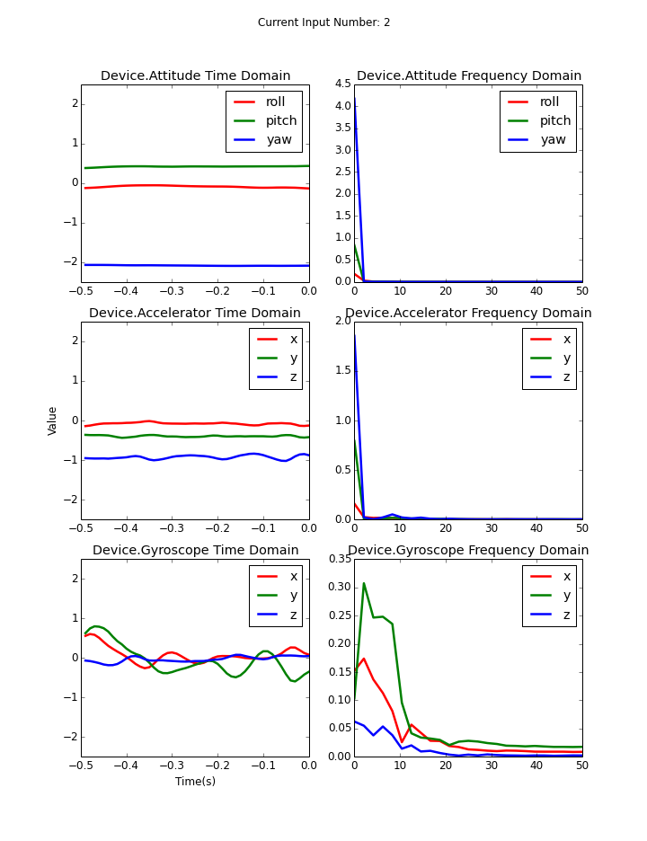

# DATA-INFOVIS-README

This folder include the PIN-Entry study datasets infovis images from user 01 to 16.
Images draws time domain and frequency domain of the buffer of attitude/accelerator/gyroscope sensors, the following image show how it looks like:



### Dowloads

* [infovis.zip](www.changkun.info/dataset/motiontouch/infovis.zip)

### Usage

The infovis.zip package now including visualization of iPhone 6 Plus test data, which have 16 folders and each of them are named by the user_id from 01 to 16.

#### Folder Structure
```
-+ userID
 |
 +--+ dataType.deviceType
    |
    +--+ postureNumber
       |
       +--+ globalTapCount-localTapCount-tapNumber.png
```

Description:

* **userID** 
  - from 01 to 16
* **dataType**
  - 1: moment data
  - 2: buffer data
* **deviceType**
  - 1: iPhone 6 Plus
  - 2: iPhone 5
* **postureNumber**
  - 1: Left Thumb
  - 2: Right Thumb
  - 3: Left Index Finger
  - 4: Right Index Finger
* **globalTapCount**
  - in PIN-Entry user study, every user did 360 times tap, this number is from 0 to 359.
* **localTapCount**
  - this number means the tap count per input group (6 PINs), which start at 0 and end at 5.
* **tapNumber**
  - means the number which user taped exactly