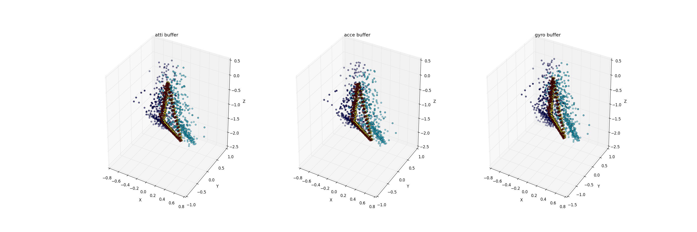

# README
Basic Visualization of different sensor, different users and different device by using mean method to pre-process buffer data.

In ``device*`` folder, it shows sixteen users buffer data by using  mean pre-process.

Here is how it looks like:

