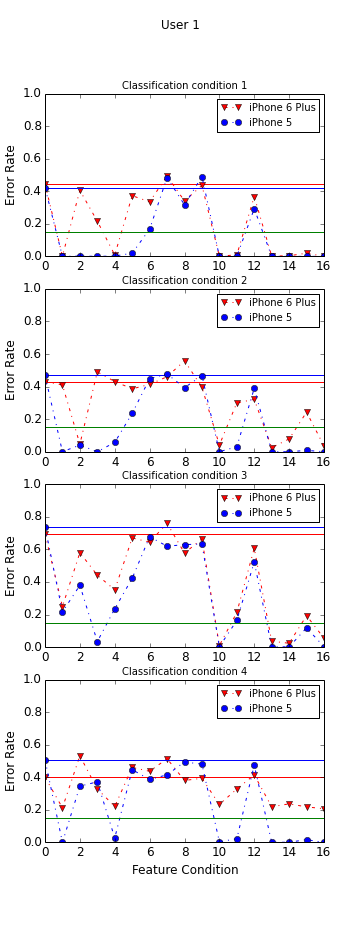
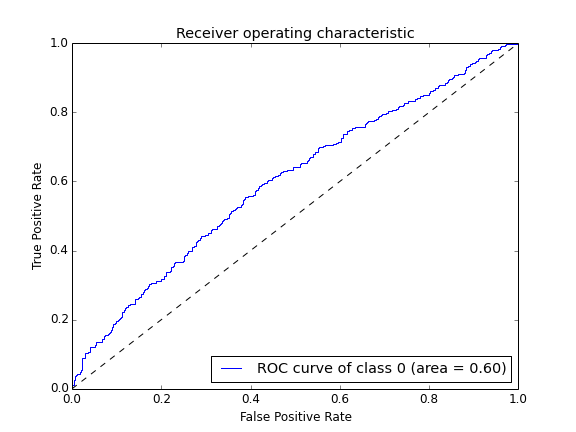

# READEME

This folder contains:

* [**Error Rate result**](./error_rate) - Error rate in each classification condition and feature conditon
* [**ROC Curve**](./xy_feature) - Receiver operating characteristic curve in cross validation.

## Examples

### Error Rate

**Using XY feature**: 

**Using Offset feature**:

### ROC Curve
Receiver operating characteristic curve is a graphical plot that illustrates the performance of a binary classifier system as its discrimination threshold is varied.

Here is a example result of Thumb classfication using attitute feature (roll, yaw, pitch):

**Using XY feature**: 

**Using Offset feature**:

## All Result Download

Link: [moment-result.zip](http://www.changkun.info/publicfiles/datasets/motiontouch/moment-result.zip)

Or you run script code by yourself to get all the results.